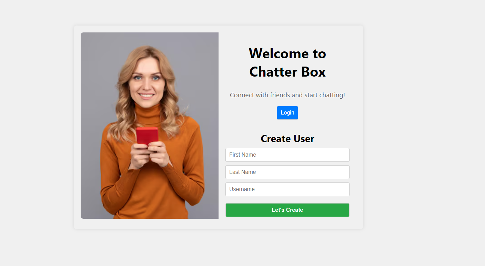
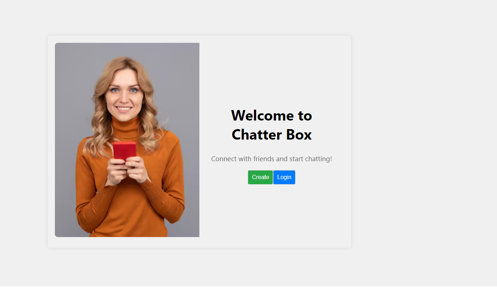

<!-- 
React Chat Application
This project is a simple real-time chat application built using React, designed to mimic a basic messaging platform.

Features
User Authentication: Users can log in with a username.
Real-time Messaging: Messages appear instantly without refreshing the page.
Message Deletion: Users can delete messages, which are hidden from their view.
Persistent Storage: Messages are stored locally in the browser.
User List: Displays a list of users available for chatting.
Technologies Used
React
JavaScript (ES6+)
HTML5 & CSS3 (styled-components)

Setup Instructions
Clone the repository

git clone https://github.com/ruchika19981512/FusionReact.git
cd react-chat-app
npm install

npm start 
git 

Usage : -

Enter your username and click Login.
Select a user from the list to start chatting.
Type a message and press Enter or click the Send button.
you can delete the message on clicking on trash icon and it will delete the whole chat for that logged in user but not for the other person

We have shown the user name by which uh are logged in and just after that we have an icon to logout for that user

also the message which will be forwarded by logged in user he/she have option to delete that message for me and for everyone 

 -->

   this is the first login page you will see create user option 
  this will be the second image you will see and will have option to create more user else login for the username you have created 